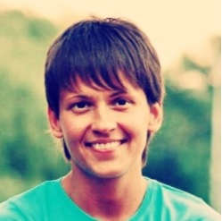

# Diana Shykh

Belarus, Minsk,
Mobile phone: +375-29-504-28-37,
Email: di.shykh@gmail.com,
Github: https://github.com/di-shykh

## Objective:

Work in the company as a front-end web developer

## Summary:

Goal oriented, life learner, deteminaion to success, pragmatic
## Skills:

**Programming languages and technologies:** JavaScript, ES6+, HTML, CSS, XML, JSON, Bootstrap, Vue.js, Firebase Realtime Database, familiar with MS SQL, C#, Windows Forms, Python

**Tools:** Git, Github, VS Code

**Operating Systems:** Linux (Mint, Ubuntu), Dos, MS Windows family Oss

**Foreign Languages:** English - Intermediate
## Education:

Institute of Information Technologies of Belarusian State University of Informatics and Radioelectronics, Faculty of Advanced Trainig and Retrainig, Software Information Systems (graduated in 2014)

Belarusian State Technological Uneversity, Faculty of Technology and Technology of the Forest Industry, Woodworking Technology (graduated in 2007)

## Professional experience:

**1. Single Page App RSS Reader (HTML, CSS, JavaScript, Vue.js, Bootstrap, Firebase)**
https://github.com/di-shykh/RssReader  

Implemented functionality:  
* search for rss feed
* saving this feed in database
* displaying articles general list/ by category/ by source
* search by articles
* displaying an article preview, go to the source site
* adding an article to the list for reading (read later)
* share article in social networks
* change user settings (color scheme, font)
* edit source (change name, category, unsubscribe)

**2. Calendar app (HTML, CSS, Less, Javascript, jQuery)**
https://github.com/di-shykh/calendar  

Implemented functionality:   
* displaying a calendar with saved events (events are saved in the browser’s local      storage)
* adding new events, editing and deleting events
* event search

**3. Quiz app. Psychological tests for children (HTML, CSS, Javascript)** 
https://github.com/di-shykh/psihological_tests_for_kids  

**4. E-commerce web-site layout (HTML5, CSS3, Flexbox)**   
https://github.com/di-shykh/site-layout  

**5. The diploma project for the automated calculation of parts and the receipt of reports for the production enterprise (C#, Windows Forms, MS SQL)**  

### Work experience:

**1. 2014-until now engineer design technologist at “Konviga”**  

During the time at the company, I showed the flexibility of thinking. I engineered a large number of different products from various materials. Demonstrated negotiation abilities, finding a common language with people with diverse backgrounds. Gathered requirements from high profile customers and transferred them to production line workers.  

Engineered interiors and furniture including the presidential suite in “The Alexander, a Luxury Collection Hotel” one of the most expensive hotels in Yerevan, Armenia.  

Engineered interiors and furnishings for the upper class customers. Finished objects in Moscow, St. Petersburg, Monaco, Geneva, Montenegro, Georgia.  

**2. 2012-2014 engineer design technologist at “Amkvadro”**  

Engineered furniture, doors and interiors for the upper class customers.  

**3. 2007-2012 engineer design technologist at “Delta”**  

During the time at the company, I showed myself as a team player and a responsible person. I ended projects on time, performed a lot of work in a short time and quickly studied.  

Engineered interiors in several rooms in the residence of the President of the Republic of Belarus.  

Engineered furniture and interior at the reconstruction of the Opera Theater in Minsk.  

Engineered an interior in one of the halls of the Nesvizhsky castle during its reconstruction.  
